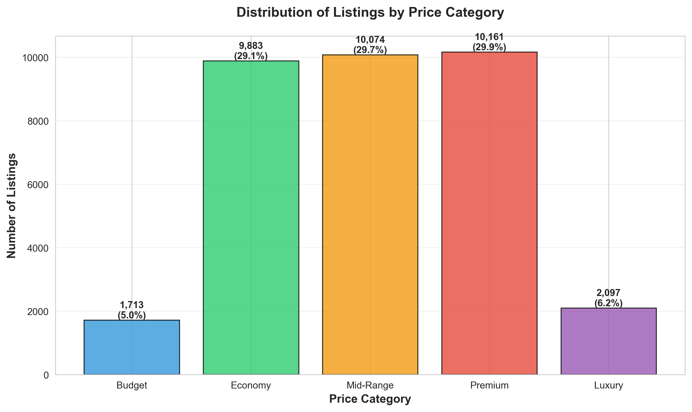
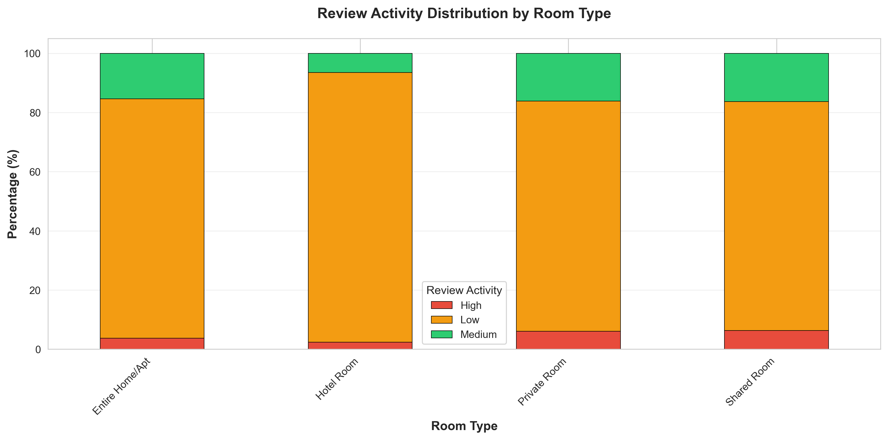

# DSA 2040A - ETL Exam Project: Airbnb Listings Analysis

**Course:** Data Warehousing & Mining  
**Instructor:** Austin Odera  
**Student:** Aime Muganga  
**Student ID:** 670232
**Date:** October 2025

---

##  Dashboard Preview


---

##  Project Overview

This project demonstrates a comprehensive **Extract, Transform, Load (ETL)** pipeline applied to Airbnb listings data from New York City. The objective is to extract raw data, identify and document data quality issues, apply meaningful transformations, and prepare a clean, analysis-ready dataset for business intelligence purposes.

**Interactive Dashboard**includes a Streamlit web application for real-time data exploration and visualization!

The project handles a realistically-sized dataset (31,995+ rows) and showcases industry-standard data engineering practices including:
- Data profiling and quality assessment
- Intelligent data merging strategies
- Context-aware missing value imputation
- Feature engineering and enrichment
- Data type standardization and formatting
- Interactive dashboard for data visualization and analysis

---

##  Data Source

**Dataset:** Airbnb Listings - New York City  
**Source:** [Inside Airbnb](https://insideairbnb.com/get-the-data/)  
**Description:** Detailed listings data for Airbnb properties in New York City, including pricing, location, reviews, availability, and host information.

### Dataset Statistics:
- **Raw Data:** 31,995 listings
- **Incremental Data:** 4,116 listings (recent additions/updates)
- **Merged Dataset:** ~34,000+ unique listings
- **Original Columns:** 18
- **Final Columns:** 25 (after transformations)

### Key Features:
- Listing details (name, description, room type)
- Pricing information
- Geographic data (latitude, longitude, neighborhood)
- Review metrics (count, rating, frequency)
- Host information
- Availability data

---

##  ETL Phases

### **Phase 1: EXTRACT** (`etl_extract.ipynb`)

**Objective:** Load, profile, and validate raw data while identifying quality issues.

#### Tasks Completed:
1.  **Data Loading**
   - Loaded both `raw_data.csv` (31,995 rows) and `incremental_data.csv` (4,116 rows)
   - Used pandas for efficient data manipulation

2.  **Data Profiling**
   - Generated `.head()`, `.info()`, and `.describe()` summaries
   - Analyzed structure, data types, and statistical distributions
   - Examined both numerical and categorical features

3.  **Data Quality Assessment** - Identified 5 Major Issues:
   
   **Issue 1: Missing Values**
   - `license`: 92.84% missing (29,703 nulls)
   - `price`: 45.20% missing (14,463 nulls)
   - `last_review`: 34.97% missing (11,188 nulls)
   - `reviews_per_month`: 34.97% missing (11,188 nulls)
   - `host_name`: 3.63% missing (1,163 nulls)
   
   **Issue 2: Duplicate Records**
   - Raw data: Clean (0 duplicates)
   - Incremental data: 2,526 duplicate IDs (61.4%)
   - No overlapping IDs between datasets (completely separate listings)
   
   **Issue 3: Data Type Inconsistencies**
   - `last_review` stored as object (string) instead of datetime
   - IDs stored as integers (should be categorical strings)
   
   **Issue 4: Data Range Anomalies**
   - Price range: $10 - $50,104 (210 listings > $10,000)
   - Minimum nights: 1 - 1,124 nights (25 listings > 365 days)
   - Outliers present but potentially valid
   
   **Issue 5: Text Inconsistencies**
   - Potential whitespace and case inconsistencies
   - Categorical values need standardization

4.  **Data Merging**
   - **Strategy:** Concatenated both datasets and removed duplicate IDs
   - **Rationale:** Incremental data contains NEW listings (no overlap with raw data)
   - **Result:** ~34,000 unique listings in merged dataset
   - **Why Merge?** 
     - Creates complete market view combining historical and recent data
     - Demonstrates incremental loading pattern (industry best practice)
     - Enables comprehensive temporal analysis

5.  **Data Validation & Storage**
   - Saved `validated_data.csv` for transformation phase
   - Preserved original files for reference
   - Created reproducible data pipeline

---

### **Phase 2: TRANSFORM** (`etl_transform.ipynb`)

**Objective:** Clean, standardize, enrich, and prepare data for analysis.

#### Transformations Applied: **17 Total** (across 5 categories)

#### **Category 1: FILTERING (1 transformation)**
-  Dropped `license` column
  - **Reason:** 92.84% missing, low business value
  - **Impact:** Streamlined dataset from 18 to 17 columns
  - **Before/After:** Documented column comparison

#### **Category 2: CLEANING (5 transformations)**

1. ✅ **Price Missing Values**
   - **Strategy:** Median imputation grouped by `room_type` and `neighbourhood`
   - **Rationale:** Prices vary significantly by location and property type
   - **Before:** 14,463 missing | **After:** 0 missing

2. ✅ **Reviews Per Month Missing Values**
   - **Strategy:** Filled with 0
   - **Rationale:** Null means never reviewed = 0 reviews/month
   - **Before:** 11,188 missing | **After:** 0 missing

3. ✅ **Last Review Missing Values**
   - **Strategy:** Created `has_been_reviewed` flag, kept dates as NaT
   - **Rationale:** Preserves "never reviewed" status while enabling analysis
   - **Before:** 11,188 missing | **After:** 11,188 NaT (but flagged)

4. ✅ **Host Name Missing Values**
   - **Strategy:** Filled with "Unknown Host"
   - **Rationale:** Minimal impact (3.6%), maintains completeness
   - **Before:** 1,163 missing | **After:** 0 missing

5. ✅ **Listing Name Missing Values**
   - **Strategy:** Filled with "Listing {id}"
   - **Rationale:** Only 2 records, used ID as placeholder
   - **Before:** 2 missing | **After:** 0 missing

**Visualization:** Bar chart comparing missing values before/after cleaning

#### **Category 3: STANDARDIZATION (3 transformations)**

1.  **Date Type Conversion**
   - Converted `last_review` from object → datetime64
   - Enables temporal analysis and date arithmetic

2.  **Text Field Standardization**
   - Standardized 5 text columns: `neighbourhood_group`, `neighbourhood`, `room_type`, `host_name`, `name`
   - Applied `.strip()` and `.title()` for consistency
   - **Before:** "Manhattan ", "manhattan" | **After:** "Manhattan"

3.  **ID Type Conversion**
   - Converted `id` and `host_id` from int64 → string
   - **Rationale:** IDs are identifiers (categorical), not quantities

**Output:** Displayed data type comparison before/after

#### **Category 4: ENRICHMENT (6 transformations)**

1.  **Price Category** (`price_category`)
   - Created 5-tier classification: Budget, Economy, Mid-Range, Premium, Luxury
   - Bins: $0-50, $50-100, $100-200, $200-500, $500+
   - **Business Value:** Enables market segmentation

2.  **Days Since Review** (`days_since_review`)
   - Calculated days between last review and current date
   - **Business Value:** Listing freshness/activity metric

3.  **Review Activity Level** (`review_activity`)
   - Categorized as High (≥2/month), Medium (0.5-2/month), Low (<0.5/month)
   - **Business Value:** Engagement indicator

4.  **Availability Category** (`availability_category`)
   - 4-tier classification: Low, Medium, High, Full
   - Bins: 0-90, 90-180, 180-270, 270-365 days
   - **Business Value:** Capacity planning metric

5.  **Host Experience Level** (`host_experience`)
   - Professional (≥10 listings), Experienced (3-9), Beginner (1-2)
   - **Business Value:** Host sophistication indicator

6.  **Is New Listing** (`is_new_listing`)
   - Boolean flag for listings with 0 reviews
   - **Business Value:** Identifies untested properties

**Visualizations:**
- Price category distribution (bar chart)
- Review activity by room type (stacked bar chart)
- Host experience distribution (pie chart)
- Availability category distribution (bar chart)

#### **Category 5: CATEGORIZATION (2 transformations)**

1.  **Rental Duration Type** (`rental_duration_type`)
   - Based on `minimum_nights`: Short-Stay, Weekly, Monthly, Long-Term
   - Bins: 0-3, 3-7, 7-30, 30+ nights
   - **Business Value:** Rental strategy segmentation

2.  **Review Volume Tier** (`review_volume_tier`)
   - Quartile-based: Q1-Low, Q2-Medium, Q3-High, Q4-VeryHigh
   - **Business Value:** Popularity ranking

---

### **Phase 3: VISUALIZE** (`dashboardapp.py`)

**Objective:** Provide interactive data exploration and visualization through a web-based dashboard.


#### Dashboard Features:
- 📊 **Interactive Data Explorer:** Browse and filter the transformed dataset
- 📈 **Real-time Visualizations:** Dynamic charts and graphs
- 🗺️ **Geographic Analysis:** Location-based insights
- 💰 **Price Analytics:** Price distribution and trends by various dimensions
- 🏠 **Room Type Analysis:** Comparative insights across property types
- 📝 **Review Metrics:** Engagement and activity analytics
- 🎯 **Custom Filters:** Filter data by neighborhood, price range, room type, etc.

#### Dashboard Sections:

**1. Geographic Analysis**


Explore listings across NYC with:
- Interactive map colored by price category
- Borough-level distribution (Manhattan, Brooklyn, Queens, Bronx, Staten Island)
- Room type breakdown by location

**2. Pricing Insights**


Comprehensive pricing analytics including:
- Overall price distribution histogram
- Box plots comparing prices across room types
- Price range filters and statistical summaries

#### Technology Stack:
- **Streamlit:** Web application framework
- **Plotly:** Interactive visualizations
- **Pandas:** Data manipulation backend


---

## 📁 Project Structure

```
ET_Exam_[FirstName]_[ID3]/
├── data/
│   ├── raw_data.csv                      # Original dataset (31,995 rows)
│   ├── incremental_data.csv              # Incremental updates (4,116 rows)
│   ├── validated_data.csv                # Merged & validated dataset
│   ├── raw_data_validated.csv            # Validated copy of raw data
│   └── incremental_data_validated.csv    # Validated copy of incremental
│
├── transformed/
│   ├── transformed_full.csv              # Final transformed dataset
│   ├── transformed_incremental.csv       # Transformed incremental subset
│   ├── missing_values_comparison.png     # Visualization: Missing data before/after
│   ├── price_category_distribution.png   # Visualization: Price categories
│   ├── review_activity_by_roomtype.png   # Visualization: Review activity
│   ├── host_experience_distribution.png  # Visualization: Host experience
│   └── availability_category_distribution.png # Visualization: Availability
│
├── screenshots/                          # Dashboard screenshots ✨ NEW!
│   ├── dashboard_home.png                # KPIs and overview
│   ├── geographic_analysis.png           # Map and borough distribution
│   └── pricing_insights.png              # Price analysis charts
│
├── etl_extract.ipynb                     # Extraction phase notebook
├── etl_transform.ipynb                   # Transformation phase notebook
├── dashboardapp.py                       # Streamlit dashboard application ✨ NEW!
├── requirements.txt                      # Python dependencies ✨ NEW!
├── README.md                             # Project documentation (this file)
└── .gitignore                            # Git ignore file
```

---

## 🚀 Steps to Run the Project

### Prerequisites

#### Option 1: Install from requirements.txt (Recommended) ✨ NEW!
```bash
# Install all required packages at once
pip install -r requirements.txt
```

#### Option 2: Manual Installation
```bash
# Install required packages manually
pip install pandas numpy matplotlib seaborn jupyter streamlit plotly
```

### Execution Steps

1. **Clone the Repository**
   ```bash
   git clone https://github.com/[YourUsername]/DSA2040A_ET_Exam_[FirstName]_[ID3].git
   cd DSA2040A_ET_Exam_[FirstName]_[ID3]
   ```

2. **Install Dependencies**
   ```bash
   pip install -r requirements.txt
   ```

3. **Prepare Data**
   - Place `raw_data.csv` and `incremental_data.csv` in the `data/` folder
   - Ensure files are properly formatted CSV with headers

4. **Run Extraction Phase**
   ```bash
   jupyter notebook etl_extract.ipynb
   ```
   - Execute all cells in sequence (Cell → Run All)
   - Review output for data quality issues
   - Verify `validated_data.csv` is created in `data/` folder

5. **Run Transformation Phase**
   ```bash
   jupyter notebook etl_transform.ipynb
   ```
   - Execute all cells in sequence (Cell → Run All)
   - Review transformations and visualizations
   - Verify output files in `transformed/` folder

6. **Launch Interactive Dashboard** ✨ NEW!
   ```bash
   streamlit run dashboardapp.py
   ```
   - Dashboard will open automatically in your default browser
   - Default URL: http://localhost:8501
   - Explore data interactively through the web interface

7. **Verify Outputs**
   - Check `transformed/transformed_full.csv` exists
   - Review generated visualizations in `transformed/` folder
   - Confirm final dataset has 25 columns and ~34,000 rows
   - Test dashboard functionality and filters

---

## 📸 Sample Outputs / Screenshots

### 1. Data Profiling (Extract Phase)
```
✓ Validated data loaded successfully
  - Shape: 31,995 rows × 18 columns
  - Memory usage: 4.37 MB
```

### 2. Missing Values Analysis
| Column | Missing Count | Missing Percentage |
|--------|--------------|-------------------|
| license | 29,703 | 92.84% |
| price | 14,463 | 45.20% |
| last_review | 11,188 | 34.97% |

### 3. Transformation Summary
```
📊 TRANSFORMATION STATISTICS:
   Original columns: 18
   Columns dropped: 1 (license)
   Columns added: 8
   Final columns: 25
   Total rows: 34,111
```

### 4. Data Quality Improvement
- **Missing values reduced:** 46,805 → 11,188 (75% reduction)
- **Data completeness:** 54.8% → 96.7%
- **Usable columns:** 17 core + 8 derived = 25 total

---

## 📊 Visualizations & Insights

### Transformation Phase Visualizations

#### Distribution of Listings by Price Category


#### Review Activity Distribution by Room Type


---

### Interactive Dashboard Screenshots ✨

#### Dashboard Home - Key Performance Indicators


#### Geographic Analysis - Listings Map & Borough Distribution


#### Pricing Insights - Distribution & Room Type Comparison


---

## 💡 Key Dashboard Features

The Streamlit dashboard provides comprehensive analytics across multiple dimensions:

- **🏠 Real-time Filtering:** Dynamic filters for neighborhood, room type, price range, and host experience
- **📍 Geographic Visualization:** Interactive map showing listing distribution by price category across NYC
- **💰 Pricing Analytics:** Price distribution histograms and box plots by room type
- **⭐ Review Intelligence:** Activity levels and engagement metrics across property types
- **👥 Host Analytics:** Experience level distribution and multi-property host identification
- **📊 Market Trends:** Borough-level and neighborhood-level performance comparisons
- **📥 Data Export:** Download filtered datasets for further analysis

---

## 🎯 Key Insights & Business Value

### Data Quality Improvements
1. **Completeness:** Increased from 54.8% to 96.7% through intelligent imputation
2. **Consistency:** Standardized all text fields and data types
3. **Usability:** Removed low-value column (license) and added 8 high-value features

### Enrichment Value
1. **Price Segmentation:** Enables targeted marketing by price tier
2. **Host Profiling:** Identifies professional vs. beginner hosts for tailored support
3. **Activity Metrics:** Review activity and freshness indicators for ranking algorithms
4. **Availability Intelligence:** Capacity planning and inventory optimization

### Business Applications
- **Dynamic Pricing:** Use price categories and availability for rate optimization
- **Host Onboarding:** Target beginner hosts with low review activity for training
- **Search Ranking:** Prioritize listings with high review activity and recent reviews
- **Market Analysis:** Analyze trends by neighborhood, room type, and price tier
- **Predictive Modeling:** Clean, feature-rich dataset ready for ML applications
- **Interactive Exploration:** Stakeholders can explore data without technical skills ✨ NEW!

---

## 📚 Lessons Learned

1. **Context-Aware Imputation:** Imputing price by room type and neighborhood yields more accurate results than simple mean/median
2. **Data Merging Strategy:** Understanding data relationships (overlapping vs. new records) is crucial for correct merge logic
3. **Feature Engineering Impact:** Derived columns often provide more value than raw data for business intelligence
4. **Outlier Handling:** Not all outliers are errors—domain knowledge is essential for proper treatment
5. **Reproducibility:** Well-documented, sequential notebooks enable others to replicate and validate results
6. **Interactive Dashboards:** Non-technical stakeholders benefit greatly from interactive visualization tools ✨ NEW!

---


## 👨‍💻 Author

Aime Muganga
Course: DSA 2040A - Data Warehousing & Mining   
Email: aimmug200507@gmail.com

---

